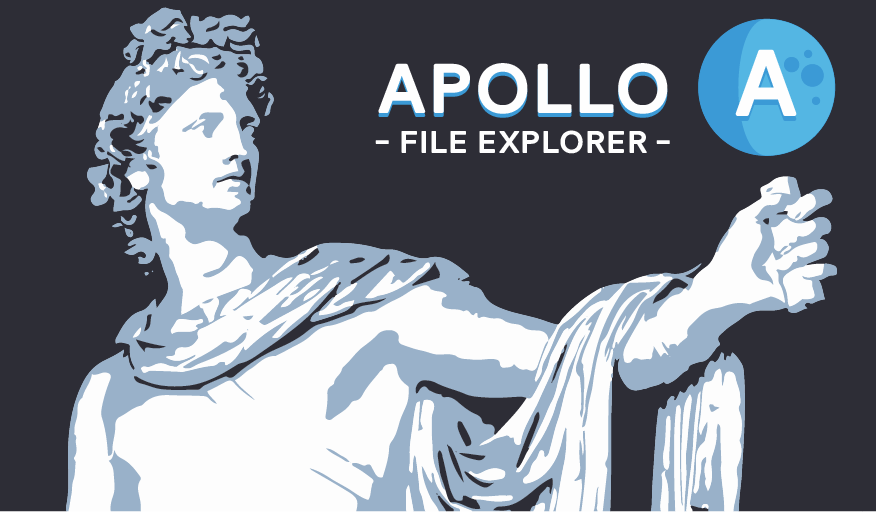

 []() []()

Apollo is a File Explorer Homebrew for the Nintendo Switch. Its goal is to be the most convenient and reliable method to manage console's files. 

# Table of contents

1. [Overview](#overview)
2. [Screenshots](#screenshots)
3. [Planned features](#planned-features)
4. [Compiling](#compiling)
5. [Credits](#credits)

## Overview

Apollo's current features are:

- **Graphical User Interface**: Minimalist design which is based on default hbmenu and official home menu esthetic.
- **Selecting items**: A simple but mandatory feature.
- **Copying files and directories**: Before doing so, application checks whether user is trying to overwrite currently existing files or directories and then asks about overwriting them.
- **Recursive directory deletion**: It allows for complete deletion of directories' content and obviously for file deletion.
- **Renaming files and directories**: Speaks for itself.
- **Sorting items**: Alphabetically or reversed.

## Screenshots
  <p align="center"></p>
  <p align="center"></p>
  <p align="center"></p>
  <p align="center"></p>
  
## Planned features

Planned features for the very next release:

- Moving files and directories
- Showing files and directories' information (size, permissions)
- Sorting files by size and reversed
- Remembering cursor's position while browsing between folders
- Viewing images
- Viewing text files
- Extracting .rar and .zip files
- Creating directories and files

## Compiling

You need to clone Apollo's repo to your computer.
``` bash
$ git clone https://github.com/evo-brut3/Apollo.git
```
Make sure that you have the newest release of [devkitPro and libNX](https://switchbrew.org/wiki/Setting_up_Development_Environment).

Use the pacman package manager to download and install following libraries: 
``` bash
$ pacman -S switch-sdl2 switch-sdl2_ttf switch-sdl2_image switch-sdl2_gfx switch-sdl2_mixer switch-mesa switch-glad switch-glm switch-libdrm_nouveau switch-libwebp switch-libpng switch-freetype switch-bzip2 switch-libjpeg-turbo
```
Compile the Plutonium.
``` bash
$ cd Plutonium
$ make
```
Then copy content of `\Plutonium\Output\include` directory to the `\include` folder and the content of `\Plutonium\Output\lib` to the `\Plutonium\lib` directory.

Then compile the Apollo.
``` bash
$ cd ..
$ make
```
Voila.

## Credits

- [devkitPro](https://devkitpro.org/) for providing toolchain.
- [XorTroll](https://github.com/XorTroll/) for the amazing Plutonium which allowed Apollo to look like this and the Goldleaf which is a mine of knowledge.
- [GilFerraz](https://www.reddit.com/user/GilFerraz/) for his beautiful Miiverse UI concept which inspired me to create sidebar.
- [Lucas Lacerda](https://dribbble.com/LucasLacerdaUX) for his Nintendo Switch UI Concept.
- [jaames](https://github.com/jaames/) for the nx-hbmenu mockup which helped me with the design.
- **Nintendo** for security <3.

